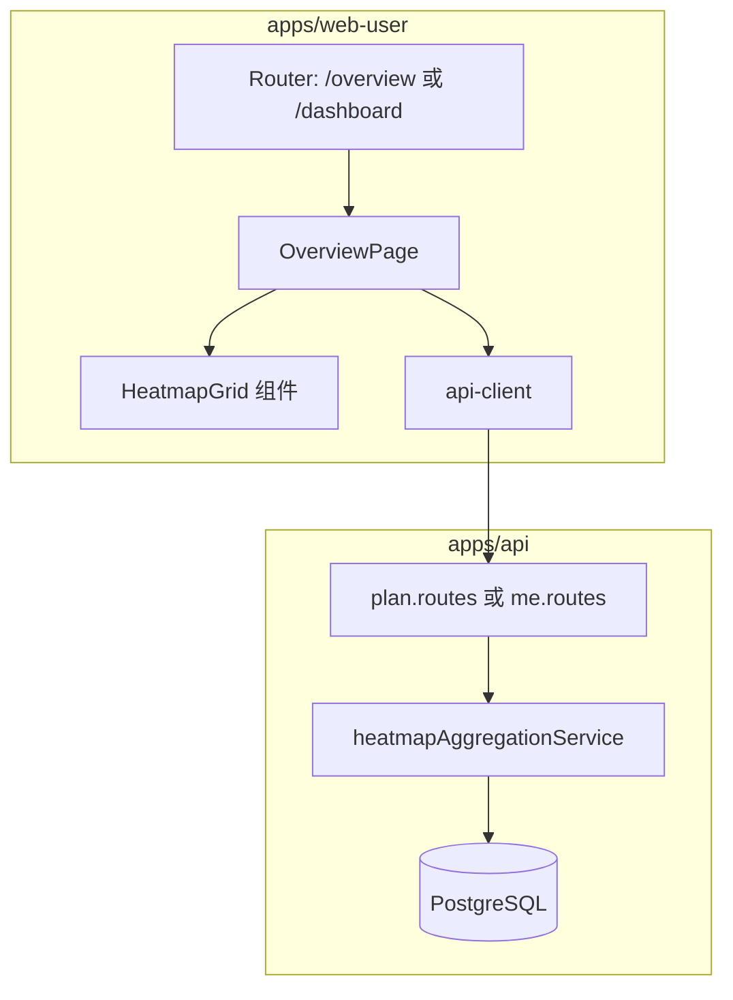
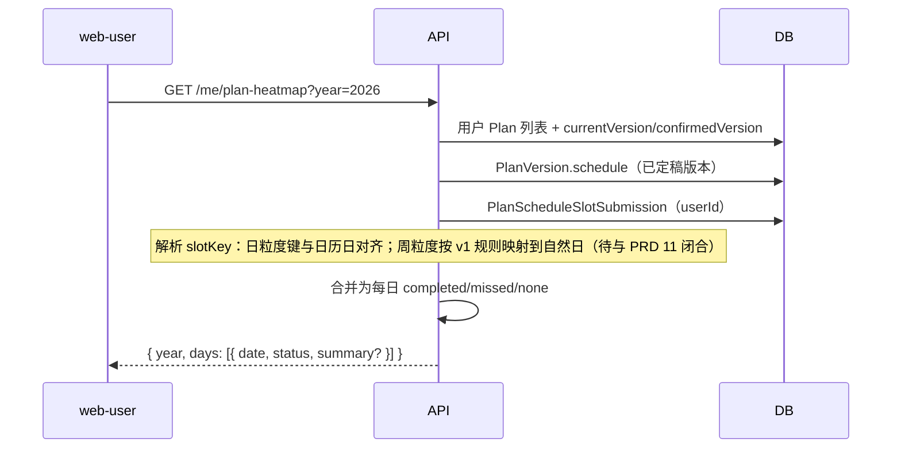

# 架构设计：ai-plan（本迭代重点 · 用户端概览与计划完成热力图）

| 属性 | 内容 |
|------|------|
| 状态 | **已批准**（2026-04-14） |
| 关联 PRD | `.ai/specs/2026-04-14-dashboard-overview-prd.md`（**已批准**） |
| 记忆目录 | `ai-plan/.ai/` |

> 说明：仓库内未找到 `template-arch.md`，本文档采用与现有 `.ai/plans`、规格文档一致的结构；全仓基线栈见下文「现有系统上下文」。

---

## 1. 现有系统上下文（基线）

| 层级 | 技术选型 | 路径/说明 |
|------|----------|-----------|
| API | Fastify + Prisma + PostgreSQL | `apps/api` |
| 用户端 | Vue 3 + Vite + Vue Router + Vitest | `apps/web-user` |
| 认证 | JWT（Bearer） | 与现有 `/auth/*`、`/plans/*` 一致 |
| 计划打卡 | `PlanVersion.schedule`（JSON：`CheckinSchedule`，`granularity` day/week + `slots[]`）；`PlanScheduleSlotSubmission`（按 `planId` + `slotKey` + `userId`） | `schema.prisma`、`schedule-slot-checkin.service.ts` |

---

## 2. 本迭代架构目标

在**不破坏现有定稿计划与打卡模型**的前提下，新增：

1. **只读聚合 API**：按用户、按年（可选扩展按月）返回「每个自然日」的展示状态 `completed | missed | none`（与 PRD 5.1 语义一致）。
2. **概览页**：`web-user` 新路由 + 热力图组件（网格、月份标签、Tooltip、图例、基础无障碍）。
3. **错误与加载**：与现网一致（中文友好提示、统一 Toast 策略若已存在则复用）。

---

## 3. 架构模式

- **BFF 式 JSON API**：浏览器仅调用 `apps/api`，不直连数据库。
- **服务端为单一真相（SoT）**：热力图颜色规则在 **API 层纯函数/服务** 中实现，便于单测与前后端契约稳定；前端只负责展示与交互。
- **无新增核心表（首选）**：聚合由现有 `Plan` + `PlanVersion.schedule` + `PlanScheduleSlotSubmission` 在查询时计算；若性能不足再评估物化表/缓存（Out of scope 除非压测失败）。

---

## 4. 系统层次结构



---

## 5. 组件与职责

| 组件 | 职责 |
|------|------|
| `GET /me/plan-heatmap`（路径可评审） | 鉴权、解析 `year`、调用聚合服务、返回 DTO |
| `heatmapAggregationService`（命名可调整） | 拉取当前用户下定稿计划及其 `confirmedVersion` 对应 `schedule`；拉取相关 `PlanScheduleSlotSubmission`；按 PRD 规则生成 `days[]` |
| `OverviewPage` | 页面布局、年份切换（若 P0）、加载/错误态 |
| `HeatmapGrid` | SVG 或 CSS Grid 渲染周列×日行；Tooltip；键盘聚焦；图例 |

---

## 6. 数据流（聚合逻辑要点）



### 6.1 slotKey 与日期（与实现对齐）

- **日粒度**：现有 `buildScheduleSlotKeys` 使用 `YYYY-MM-DD` 形式键时，可直接映射到自然日。
- **周粒度**：键形如 `Wn`（见 `plan.service`），需在服务内定义 **v1 映射**（例如该周起始日所在周几对齐到 7 天或仅标在周一）；**架构上**要求该映射集中在一处函数，便于单测与后续 PRD 修订。

### 6.2 「有打卡」判定

- 以存在 `PlanScheduleSlotSubmission` 记录且 `userId` 为当前用户、`planId`+`slotKey` 对应某日应打卡槽位为准（与详情页打卡一致）。
- 若同一日多条槽位：PRD 规定「有任一遗漏则红」— 聚合时按日归约。

---

## 7. API 设计（草案）

### 7.1 `GET /me/plan-heatmap`

**Query**

| 参数 | 类型 | 必填 | 说明 |
|------|------|------|------|
| `year` | number | 否 | 默认当前年（服务器或用户时区，与实现统一） |

**Response 200**

```json
{
  "year": 2026,
  "timeZone": "Asia/Shanghai",
  "days": [
    { "date": "2026-04-14", "status": "completed", "summary": { "due": 2, "done": 2 } },
    { "date": "2026-04-15", "status": "missed", "summary": { "due": 1, "done": 0 } },
    { "date": "2026-04-16", "status": "none" }
  ]
}
```

- `status`：`completed` | `missed` | `none`（与 PRD 绿/红/灰一致）。
- `summary`：可选；用于 Tooltip，前端无则仅显示日期。

**错误**

| 状态码 | 说明 |
|--------|------|
| 401 | 未登录 |
| 400 | year 非法 |

---

## 8. 前端状态与路由

- **路由建议**：`/overview`（对外文案「概览」）或 `/dashboard`；与 `router` 现有懒加载模式一致。
- **状态**：页面级 `loading` / `error`；热力图数据来自单次请求；年份切换触发重新请求。
- **与 api-client**：在 `api-client.ts` 增加 `getPlanHeatmap({ token, year? })`，错误信息走现有中文映射。

---

## 9. 安全设计

- 所有查询 **强制 `userId = 当前 JWT sub`**，禁止按 planId 越权读取他人提交。
- 仅聚合**已定稿**计划（与「我的计划」列表语义一致）；草稿阶段是否计入热力图：**默认否**（避免噪音），若产品改为「计入」需在 PRD 补丁中说明。

---

## 10. 性能与可扩展

- 单用户一年 365 天，响应体小；主要成本在「读 schedule JSON + submissions」— 首期可用 **按用户批量查询** + 内存聚合。
- 若计划数或提交量增大：可加 `(userId, createdAt)` 索引复核、或按年裁剪 submissions 查询范围。

---

## 11. 测试策略

| 层级 | 内容 |
|------|------|
| API | 对聚合服务写 Vitest：固定 schedule + submissions 快照 → 期望 `days[]` |
| Web | Heatmap 组件：有无数据、三种 status 渲染；可选快照测 |

---

## 12. 依赖 PRD 待决策项（架构侧输入）

- 导航文案不改变接口形状；仅影响路由 meta 与菜单。
- **周槽位映射**闭合后，更新本节 6.1 与聚合单测用例。
- **草稿是否计入**：默认否，已写入 9；若变更需同步 PRD。

---

## 13. 审批

- 审批人：用户  
- 结论：**已批准**（可进入需求拆解/故事）  
- 日期：2026-04-14  
