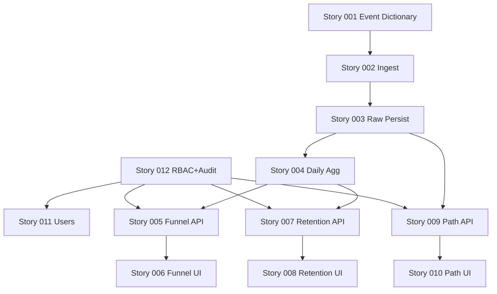

# Epic：web-admin 运营增长分析工作台（Funnel / Retention / Path）

| 属性 | 内容 |
|------|------|
| 状态 | **已批准**（2026-04-22） |
| 关联 PRD | `.ai/specs/2026-04-22-web-admin-growth-analytics-prd.md` |
| 关联架构 | `.ai/specs/2026-04-22-web-admin-growth-analytics-arch.md` |
| 优先级 | P0 |
| 业务价值 | 用数据回答增长问题并形成后续触达/治理闭环 |

---

## 1. 目标

在 1 个 Epic 内交付可用的“分析工作台”最小闭环：

- 有可用的数据管道（事件 ingest + 聚合）
- 有三类核心报表（漏斗/留存/路径）
- 有 drill-down 到用户画像的能力
- 有 RBAC 与审计，满足管理后台合规要求

---

## 2. 验收标准（Epic 级）

1. 管理端可访问「分析」模块，具备基本筛选与导出。
2. 漏斗/留存/路径三类报表至少各有 1 个预置模板，并支持按渠道/版本/时间切片。
3. drill-down 支持从报表跳转到用户列表/用户详情（只读画像）。
4. 导出与敏感操作在审计日志中可追溯。
5. 事件字典 v1 落地，服务端对 properties 做白名单校验与脱敏。

---

## 3. Feature 列表（建议拆分）

| Feature | 优先级 | 状态 |
|---------|--------|------|
| Telemetry ingest（事件接收 + 治理） | P0 | 待办 |
| Analytics 聚合（按日/维度） | P0 | 待办 |
| 漏斗报表（查询接口 + web-admin 页面） | P0 | 待办 |
| 留存报表（查询接口 + web-admin 页面） | P0 | 待办 |
| 路径报表（查询接口 + web-admin 页面） | P0 | 待办 |
| 用户画像 drill-down（列表/详情） | P0 | 待办 |
| RBAC + 审计（导出/敏感查询） | P0 | 待办 |

---

## 4. 依赖

- 已有用户体系（auth / JWT / 管理端登录）可复用；若不存在，需先补齐基础 RBAC（P0）
- 数据库迁移能力（Prisma）与现有 schema

---

## 5. 风险与缓解

- 口径不清 → 先写清事件字典与计算规则（PRD 5.x），并做抽样对账
- 性能风险 → 预聚合优先，raw 表短保留
- 隐私风险 → properties 白名单 + 脱敏 + 审计

---

## 6. Story 列表与建议顺序（P0）

> 目标：先打通数据通路，再做报表与 drill-down；RBAC/审计尽早接入，避免后期返工。

1. **Story 012**：RBAC 权限点接入 + 审计日志基础设施（为后续接口与导出兜底）
2. **Story 001**：事件字典 v1（schema registry 与口径）
3. **Story 002**：ingest 接口 v1（双轨鉴权 + 限流）
4. **Story 003**：raw 表落库（schema + 索引）与 ingest 持久化
5. **Story 004**：按日聚合 job（raw → daily_agg）
6. **Story 005**：漏斗 API v1
7. **Story 006**：web-admin 漏斗报表页
8. **Story 007**：留存 API v1
9. **Story 008**：web-admin 留存报表页
10. **Story 009**：路径 API v1
11. **Story 010**：web-admin 路径报表页
12. **Story 011**：管理端用户列表与详情（最小画像 + 报表 drill-down 落点）

---

## 7. 依赖关系图（Mermaid）

---

## 8. 审批

- 审批人：用户  
- 结论：**已批准**  
- 日期：2026-04-22  
