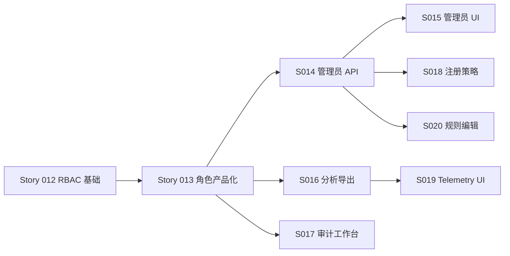

# Epic：web-admin 角色治理与运营闭环

| 属性 | 内容 |
|------|------|
| 状态 | **已批准**（2026-06-01） |
| 关联 PRD | `.ai/specs/2026-06-01-web-admin-role-governance-prd.md` |
| 实施计划 | `.ai/plans/2026-06-01-web-admin-role-governance-implementation-plan.md` |
| 优先级 | P0 |
| 业务价值 | 管理端岗位清晰、治理可审计、导出与账号管理可落地 |

---

## 1. 目标

在现有 analytics / RBAC 骨架上，交付 **角色产品化 + 管理员治理 + 导出审计** 最小闭环，解决「角色感觉不对、权限点空转」的问题。

---

## 2. 验收标准（Epic 级）

1. 三类预置角色登录后默认首页、侧栏、总览模块与 PRD 矩阵一致。
2. 超级管理员可在 UI 管理 `AdminUser`，写操作 100% 留审计。
3. `analytics:export` 在漏斗/留存/路径页可用，且审计可追溯。
4. 审计员以审计工作台为主路径，不依赖分析总览。
5. 生产默认关闭自助注册；测试/开发可通过环境变量开启。

---

## 3. Feature 列表

| Feature | 优先级 | 状态 | 文档 |
|---------|--------|------|------|
| 角色产品化（路由/导航/总览） | P0 | 待办 | `.ai/features/feature-role-productization.md` |
| 管理员账号治理 | P0 | 待办 | `.ai/features/feature-admin-account-management.md` |
| 分析导出与审计兑现 | P0 | 待办 | `.ai/features/feature-analytics-export-audit.md` |
| 审计工作台增强 | P0 | 待办 | `.ai/features/feature-auditor-workbench.md` |
| 注册策略与数据迁移 | P0 | 待办 | `.ai/features/feature-admin-register-policy.md` |
| Telemetry 运维 UI | P1 | 待办 | `.ai/features/feature-telemetry-ops-ui.md` |
| 规则可编辑 | P1 | 待办 | `.ai/features/feature-rules-editable.md` |

---

## 4. Story 列表

| Story | 名称 | 优先级 | 状态 |
|-------|------|--------|------|
| 013 | 角色配置与默认 landing | P0 | 待办 |
| 014 | 管理员账号 API | P0 | 待办 |
| 015 | 管理员账号管理 UI | P0 | 待办 |
| 016 | 分析 CSV 导出 + 审计 | P0 | 待办 |
| 017 | 审计员工作台 + 审计导出 | P0 | 待办 |
| 018 | 注册策略收口 + seed 更新 | P0 | 待办 |
| 019 | Telemetry 日聚合 UI | P1 | 待办 |
| 020 | 规则编辑 + 审计 | P1 | 待办 |

---

## 5. 依赖

- 依赖已完成的：AdminUser 模型、JWT 权限中间件、审计表与查询 API、web-admin 基础页面。
- 不依赖新业务域 schema 变更（除 `AdminUser.disabledAt` 可选列）。

---

## 6. 风险

- 权限变更影响已登录 token → 改权限后提示重新登录或短 TTL（v1：提示重新登录）。
- Windows 开发环境 pnpm symlink 问题 → 文档说明手动起 API。
