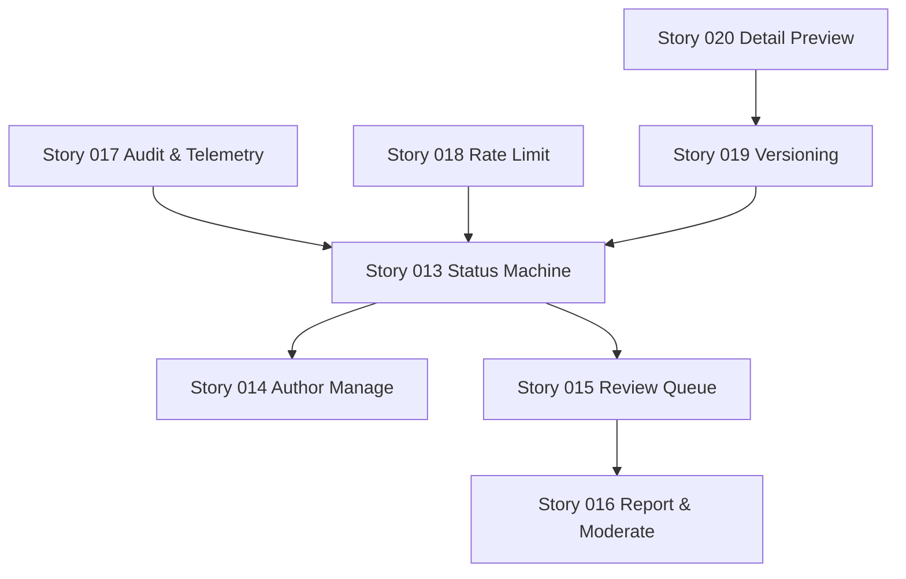

# Epic：web-user 模板市场（公开 UGC）商用化（审核/治理/版本/运营）

| 属性 | 内容 |
|------|------|
| 状态 | **待审批**（2026-05-09） |
| 关联 PRD | `.ai/specs/2026-05-09-web-user-template-market-ugc-prd.md` |
| 关联架构 | `.ai/specs/2026-05-09-web-user-template-market-ugc-arch.md` |
| 优先级 | P0 |
| 业务价值 | 降低 UGC 风险、提升模板复用转化、可持续运营增长 |

---

## 1. 目标

在 1 个 Epic 内交付公开 UGC 市场的商用最小闭环：

- 模板发布不再“即上线”，具备审核/下架/封禁闭环
- 作者可管理自己的模板（状态可见、可编辑、可下架、可重提）
- 用户具备举报入口，管理员可处置并可追溯
- 关键操作全量审计；后续可对接 Analytics 指标漏斗
- 为模板版本化与详情预览打好基础（M2）

---

## 2. 验收标准（Epic 级）

1. 公开市场只展示 `published` 模板；待审/驳回/下架/封禁均不可见且不可套用。
2. 用户发布模板后进入待审；作者在“我的模板”可见状态与审核反馈。
3. 审核员可在审核队列 approve/reject；驳回原因对作者可见；所有动作写审计。
4. 用户可举报模板；管理员可下架/封禁；处置动作写审计并可查询。
5. 对发布/点赞/收藏/套用/举报具备基础频控与幂等策略，防滥用可观测。

---

## 3. Feature 列表（建议拆分）

| Feature | 优先级 | 状态 |
|---------|--------|------|
| 模板状态机与作者侧生命周期（publish/edit/unpublish） | P0 | 待办 |
| 审核队列与审核记录（admin） | P0 | 待办 |
| 举报与处置闭环（report/moderate） | P0 | 待办 |
| 审计与埋点口径（templates domain） | P0 | 待办 |
| 基础反滥用（频控/幂等/阈值告警） | P0 | 待办 |
| 版本化与 apply 绑定版本（M2） | P1 | 待办 |
| 模板详情页与预览（M2） | P1 | 待办 |
| 运营配置与增长（推荐位/排序）（M3） | P2 | 待办 |

---

## 4. 依赖

- 已有 Auth/JWT 与 `requireRole('user')` 鉴权能力
- 已有 RBAC/审计基础设施（管理端）可复用（若不存在则需先补齐）
- Prisma 迁移流程

---

## 5. 风险与缓解

- 审核队列积压 → 发布频控 + 风险分流（可选直发白名单）\n
- 刷赞刷套用 → 频控 + 异常阈值观测 + 后续反作弊排序\n
- 合规与隐私 → payload 白名单校验 + 详情页裁剪 + 举报处置与审计\n
- 兼容性风险 → 新增字段可选 + 分阶段迁移 + 保持现有列表接口可用\n

---

## 6. Story 列表与建议顺序（P0→P1）

> 目标：先把“可控发布 + 审核/举报 + 审计/频控”闭合，再做版本/详情预览。

1. **Story 013**：模板状态机落地 + 发布默认待审 + 公开列表只出 published
2. **Story 014**：作者侧模板管理（我的模板含状态、下架、编辑触发重审）
3. **Story 015**：审核队列 API + approve/reject + 审核记录（reasonCode）
4. **Story 016**：举报 API + 管理端举报列表 + 处置动作（unpublish/ban）
5. **Story 017**：模板域审计与埋点口径统一（publish/review/unpublish/apply/report）
6. **Story 018**：基础频控（发布/点赞/收藏/套用/举报）+ 可观测 reasonCounts
7. **Story 019（P1）**：模板版本化（MarketTemplateVersion）+ apply 绑定版本
8. **Story 020（P1）**：模板详情页 + 结构化预览（不暴露完整 payload）

---

## 7. 依赖关系图（Mermaid）

---

## 8. 审批

- 审批人：用户  
- 结论：**待审批**  
- 日期：2026-05-09  

