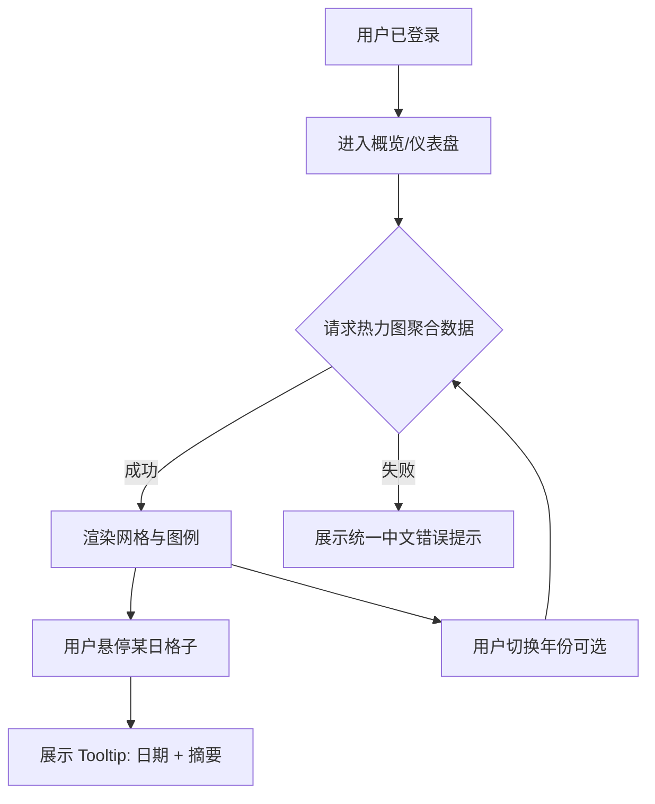
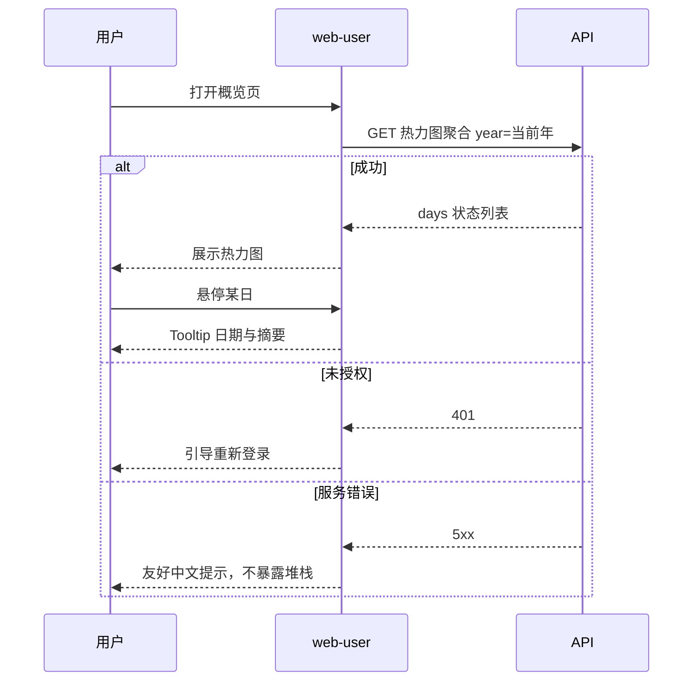

# PRD：用户端「概览 / 仪表盘」与计划完成热力图

| 属性 | 内容 |
|------|------|
| 状态 | **已批准**（2026-04-14） |
| 产品 | 计划大师（ai-plan / web-user） |
| 记忆目录 | `ai-plan/.ai/` |
| 关联能力 | 计划日程槽（schedule slots）、打卡提交（check-in） |

---

## 1. 项目目标

在用户端提供**一页总览**，让用户快速感知「最近一段时间计划执行情况」，并通过**类 GitHub 贡献热力图**的组件，按日展示完成与未完成情况，降低「计划散落、无反馈」的流失风险。

---

## 2. 要解决的问题与方案概述

| 问题 | 方案 |
|------|------|
| 用户不清楚自己是否坚持执行 | 按自然日聚合展示：有完成、有遗漏、无安排一目了然 |
| 纯列表/数字枯燥、难形成习惯 | 热力图 + 悬停说明，视觉动机接近 GitHub 贡献图 |
| 「未完成」定义不清易产生挫败感 | **仅在有当日应完成项时**才可能出现红色；无安排日为中性色 |

---

## 3. 命名与信息架构

### 3.1 中文导航名称（推荐）

- **首选（推荐）**：**「概览」** —— C 端友好，弱「后台报表」感。
- **备选**：**「仪表盘」** —— 若本页后续以图表、统计、多卡片为主，可与之并列或作为页内副标题（例如：「学习与实践仪表盘」）。
- **路由**：可与文案解耦，例如路由 `dashboard` 或 `overview`，对外仅显示中文「概览」。

### 3.2 与现有导航关系（待实现时确认）

- 入口位置：侧栏或顶栏一级项；与「我的计划」「设置」同级或作为「我的计划」子路由，由信息架构评审二选一。

---

## 4. 范围（本期）

### 4.1 In Scope

- 概览页框架：标题、简短说明、主内容区。
- **计划完成热力图**（核心）：
  - 按**周列 × 星期行**排布小格（与 GitHub 贡献图类似的网格）。
  - 顶部**月份**标签；左侧可仅标 **Mon / Wed / Fri** 等稀疏标签以省空间。
  - **悬停（Tooltip）**：至少展示**日期**（如 `2026-04-14` 或本地化格式）；建议增加**当日摘要**（见 5.3）。
  - **图例**：说明绿 / 红 / 中性色含义（文案见 5.2）。
  - **年份切换**（可选 P1）：右侧或顶部按年筛选，默认当前年；无数据年可禁用或灰显。

### 4.2 Out of Scope（可放后续 Epic）

- GitHub 截图底部的「Activity overview」雷达图、多仓库列表（除非产品明确要求同期上线）。
- 多用户/团队对比热力图。
- 导出图片/PDF。

---

## 5. 功能需求与业务规则

### 5.1 单日格子语义（与现有数据对齐）

以下规则以当前域模型为基准：**计划版本上的 `schedule`（含按日/按周槽位）** 与 **槽位打卡提交（check-in）** 为数据来源。若实现阶段发现字段命名不同，以代码与 API 为准，但**语义不变**。

| 格子颜色 | 条件（同一用户、同一自然日 D） |
|----------|--------------------------------|
| **绿色** | D 日存在**至少一条**「当日应打卡的槽位」且用户对该槽位（或当日对应规则）**已完成有效打卡**；且 D 日**不存在**仍逾期未完成的应打卡槽位。 |
| **红色** | D 日存在**至少一条**应打卡槽位，且截至产品定义的「日界」（默认自然日 24:00 或业务统一时区）**仍未完成**应计为遗漏；该日显示为红。若同日既有完成又有遗漏，**以红为准**（优先提醒风险）。 |
| **中性色（灰/浅底）** | D 日**没有任何**应打卡槽位（无计划覆盖该日、或未排期），不评价为「未完成」。 |

**说明：**

- 「应打卡槽位」：由 schedule 粒度（按天槽位 / 按周槽位映射到自然日）在服务端或与前端一致的规则中计算；PRD 要求实现侧提供**单一真相**（建议后端聚合接口）。
- **周粒度槽位**：需明确「该槽位对应哪一天算应完成」（例如周槽位落在该周周一或用户配置的周起始日）；本期若仅支持按日槽位，可在 PRD 修订中注明「周槽位映射规则 v1」。

### 5.2 图例与文案（用户可见）

- 绿：**当日有完成记录**（或当日应完成项均已达成）。
- 红：**当日有应完成但未完成**。
- 灰：**当日无应完成安排**。

### 5.3 Tooltip 内容（建议）

- 必填：**日期**（本地化）。
- 建议：**摘要句**，例如：`已完成 2 项，未完成 1 项` / `当日无计划安排` / `已完成 1 项`。
- 可选：点击格子跳转「当日相关计划或打卡详情」（P2）。

### 5.4 无障碍与色弱

- 仅靠红绿不够时：为不同状态增加**形状或边框**差异（例如未完成带细边框），Tooltip 与图例**文字**必须说明状态。
- 热力图格子需 **可聚焦 + 可读标签**（键盘/屏幕阅读器），具体实现遵循 WCAG 与项目现有组件规范。

### 5.5 响应式

- 窄屏允许**横向滚动**保留完整年视图，或提供「最近 N 周」折叠模式（P2）；本期至少保证可滚动可用。

---

## 6. 非功能需求

| 类型 | 要求 |
|------|------|
| 性能 | 年度数据建议一次请求聚合结果（按日三元组），避免前端拉全量打卡明细再算（除非数据量极小）。 |
| 安全 | 仅当前登录用户自己的计划与打卡；接口鉴权与现有 JWT 一致。 |
| 国际化 | 本期中文；日期格式与文案预留 i18n 键（可选）。 |

---

## 7. 技术决策与约束（初稿）

- **前端**：`apps/web-user`，Vue 3；图表可用纯 CSS Grid + div 或轻量自研组件，避免过重依赖（需评审）。
- **后端**：`apps/api` 提供例如 `GET /me/plan-heatmap?year=2026`（路径待定），返回 `{ days: Array<{ date: string, status: 'completed' | 'missed' | 'none' }> }` 或等价结构。
- **时区**：日界与「哪一天」以服务端统一规则为准（默认用户本地时区或 UTC+8，需与现有 deadline 处理一致）。

---

## 8. 任务序列（实施顺序建议）

1. 后端：按用户 + 年（可选月）聚合「每日状态」算法 + 单测。
2. 后端：开放只读 API + 鉴权 + 契约文档。
3. 前端：路由与「概览」页壳。
4. 前端：热力图组件 + Tooltip + 图例 + 基础无障碍。
5. 前端：Vitest/组件测或 e2e 抽检。
6. 产品验收：对照第 9 节验收标准。

---

## 9. 验收标准（可测试）

1. 登录用户打开概览页，可见**当前年**（或产品约定默认区间）热力图网格与图例。
2. 对仅有按日槽位且某日已打卡的数据：**该日格为绿色**。
3. 对有应打卡但未打卡的过去日期：**该日格为红色**（规则与 5.1 一致）。
4. 对无任何应打卡槽位的日期：**中性色**，且 Tooltip 标明「当日无计划安排」或等价文案。
5. 悬停任意格：**显示日期**；且摘要与后端数据一致（抽样比对若干日）。
6. 色弱场景下图例 + Tooltip 文字仍可理解状态（人工走查或通过边框区分）。
7. 未登录或 token 失效：不暴露他人数据，行为与现网错误处理一致。

---

## 10. 关键用例流程图（Mermaid）

### 10.1 用户查看概览与热力图

### 10.2 主角色与系统响应（含错误）

---

## 11. 待决策事项（评审时填写）

- [ ] 导航最终文案：「概览」或「仪表盘」或并列。
- [ ] 周槽位映射到自然日的具体规则（若已上线周粒度）。
- [ ] 日界与时区策略是否与 `deadline` 字段一致。
- [ ] 年份切换是否纳入本期（P0 / P1）。

---

## 12. 审批

- 审批人：用户  
- 结论：**已批准**（可进入架构/拆解）  
- 日期：2026-04-14  
