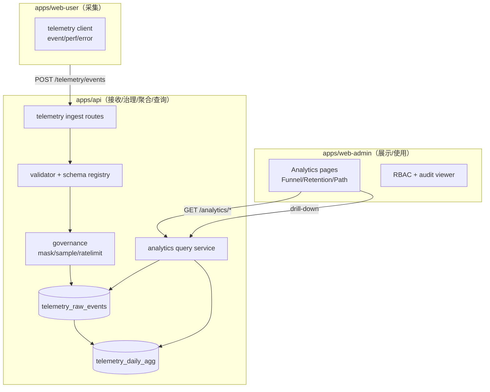

# 架构设计：web-admin「运营增长分析工作台」（Telemetry → Analytics）

| 属性 | 内容 |
|------|------|
| 状态 | **已批准**（2026-04-22） |
| 关联 PRD | `.ai/specs/2026-04-22-web-admin-growth-analytics-prd.md`（已批准） |
| 记忆目录 | `ai-plan/.ai/` |

> 说明：仓库内未找到 `template-arch.md`，本文沿用现有 `.ai/arch.md` 的结构与 Mermaid 表达方式。

---

## 1. 架构目标

在现有 `apps/api` + `apps/web-user` + `apps/web-admin` 的单体仓库结构上，新增一个**可扩展的 Telemetry → Analytics 数据通路**，以支撑 PRD 的 P0 能力（漏斗/留存/路径）：

1. **采集**（web-user）：最小埋点 SDK 规范 + 性能/错误采集入口（可先只做事件，性能与错误后续扩展）。
2. **接收与治理**（api）：统一入口（鉴权/限流/脱敏/采样/落库）。
3. **聚合与查询**（api）：按日/周预聚合 + 在线查询组合。
4. **展示与运营使用**（web-admin）：报表与 drill-down，配合 RBAC 与审计。

---

## 2. 系统层次结构（新增模块）

---

## 3. 组件与职责

| 组件 | 职责 |
|------|------|
| `telemetry ingest routes` | 接收事件上报；鉴权；schema 校验；基础限流；写入 raw 表 |
| `validator + schema registry` | 事件字典/属性白名单；拒绝敏感字段；版本兼容 |
| `governance` | 脱敏、采样、IP/UA 归一、时区与时间戳统一 |
| `telemetry_raw_events` | 原始事件存储（可保留短周期） |
| `telemetry_daily_agg` | 聚合结果（按日、按维度：渠道/版本/平台等） |
| `analytics query service` | 漏斗/留存/路径查询，优先读取聚合表，必要时回查 raw |
| web-admin `Analytics pages` | 筛选器、表格、基础图形、导出、drill-down |

---

## 4. 数据模型（v1 草案）

> 目标是：**先用 Postgres 够用**，不引入外部数据仓；未来若数据量上来，保留迁移到列存（ClickHouse 等）的空间。

### 4.1 raw 事件表（示意）

- `id`（uuid）
- `receivedAt`（server time）
- `eventTime`（client time，经过校正）
- `userId`（服务端补；匿名则为空）
- `sessionId`（可选）
- `eventName`
- `page`（可选）
- `properties`（jsonb，必须通过白名单校验与脱敏）
- `clientVersion` / `platform` / `source`（维度列，便于索引与聚合）

### 4.2 daily 聚合表（示意）

- `day`（date）
- `eventName`
- `dimensionKey`（例如 `source=xxx|platform=web|clientVersion=1.2.3`）
- `users`（去重用户数）
- `events`（事件数）
- 预留：转化计算所需的 step 聚合（可后续单独表）

---

## 5. API 设计（草案）

### 5.1 Telemetry ingest

- `POST /telemetry/events`
  - Body: `{ events: Array<{ name, time, properties, page?, sessionId? }> }`
  - Auth: token（已登录）或匿名签名（待决策）
  - Response: `{ accepted, dropped, reasonCounts }`

### 5.2 Analytics query

- `GET /analytics/funnel`
- `GET /analytics/retention`
- `GET /analytics/path`
- `GET /analytics/users`（drill-down：返回用户列表 + cursor 分页）

> 以上接口全部走 RBAC（管理端 token），并写审计（导出/敏感查询）。

---

## 6. 安全与合规

- **最小化采集**：禁止采集明文手机号/邮箱/姓名；如需联系信息，必须在用户域表中通过权限查看。
- **脱敏**：properties 默认白名单；疑似敏感字段直接丢弃并计数告警。
- **保留期**：raw 表短保留（例如 90/180 天）；聚合表长期保留（可按年归档）。
- **审计**：导出与用户级 drill-down 必须写审计日志。

---

## 7. 性能与扩展策略

- **优先预聚合**：大盘默认读 `daily_agg`，避免扫 raw。
- **索引策略**：raw 表按 `(eventName, day)` / `(userId, eventTime)` / `(source, platform, clientVersion)` 建索引（实现时评审）。
- **计算策略**：
  - 漏斗：步骤事件按 user 去重 + 时间窗口约束；可按天分桶加速。
  - 留存：cohort key（注册日/首创计划日/首次打卡日）可直接来自业务表，不强依赖事件（更稳定）。
  - 路径：Top paths 可先基于 session 内事件序列（若无 sessionId，则基于短时间窗口近似）。

---

## 8. 测试策略

| 层级 | 内容 |
|------|------|
| API | ingest 校验/脱敏/采样单测；analytics 查询口径单测 |
| Web-admin | 报表筛选器交互与空/错态渲染测试（Vitest） |
| 口径对账 | 抽样：同一条件下，API 输出与 SQL 结果一致（脚本或测试夹具） |

---

## 9. 待决策与风险

- ingest 鉴权方案（匿名签名 vs 用户 token vs 双轨）
- sessionId 的生成与跨页关联策略
- 数据量增长后 Postgres 是否足够（提前抽象存储接口）
- 路径分析计算成本（先做近似/采样）

---

## 10. 审批

- 审批人：用户  
- 结论：**已批准**  
- 日期：2026-04-22  
