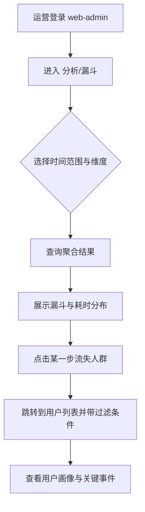
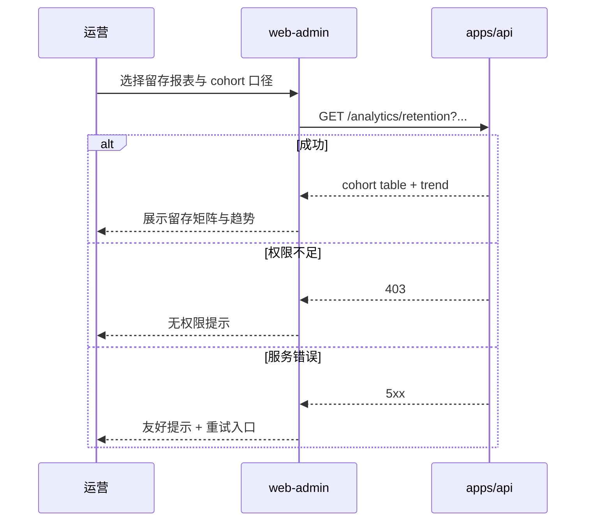

# PRD：web-admin「运营增长分析工作台」（漏斗 / 留存 / 路径优先）

| 属性 | 内容 |
|------|------|
| 状态 | **已批准**（2026-04-22） |
| 产品 | 计划大师（ai-plan / web-admin） |
| 记忆目录 | `ai-plan/.ai/` |
| 关联能力 | 用户体系、计划域、事件埋点与性能监控（Telemetry） |

---

## 1. 项目目标

为运营/增长角色提供「可解释、可行动」的分析工作台，在不干扰用户端体验与隐私合规的前提下，优先把以下三类分析能力做扎实：

1. **漏斗**：从拉新到价值达成（注册 → 创建计划 → 定稿/发布 → 首次打卡 → 连续打卡）。
2. **留存**：按 Cohort 观察次日/7日/30日留存与回流路径。
3. **路径**：关键功能的用户行为路径与流失点（页面/事件序列）。

---

## 2. 要解决的问题与方案概述

| 问题 | 方案 |
|------|------|
| 运营无法回答“用户为什么流失/卡在哪一步” | 统一事件模型 + 漏斗/留存/路径三件套，支持按时间/渠道/版本/人群切片 |
| 数据口径不一致、每次临时写 SQL | 后端聚合接口（可复用 materialized view / job 汇总）+ 管理端固定口径报表 |
| 只看数据不可行动 | 报表内置“定位到用户/分群”的入口，为后续触达（P1）与治理（P1）打基础 |

---

## 3. 角色与权限（管理端）

### 3.1 主要角色

- **运营/增长（Growth Ops）**：查看报表、创建分群、导出、配置指标看板。
- **管理员（Admin）**：管理角色权限、查看审计日志、系统配置。
- **客服/治理（Support）**：查看用户画像与行为摘要、处理举报/工单（本 PRD 非首要）。
- **风控/合规（Compliance）**：查看敏感操作审计、配置脱敏/留存策略（本 PRD 非首要）。

### 3.2 权限点（P0 先做最小集合）

- `analytics:read`：查看所有分析报表
- `analytics:export`：导出报表
- `users:read`：查看用户列表与详情（画像）
- `rbac:manage`：角色权限管理
- `audit:read`：审计日志查看

---

## 4. 范围（本期）

### 4.1 In Scope（P0：先把分析报表做扎实）

#### A. 分析报表（核心）

- **漏斗分析**
  - 预置漏斗（可配置时间窗口/去重规则）：
    - 注册 → 创建计划 → 定稿/发布 → 首次打卡
    - 首次打卡 → 3 日内至少 2 次打卡 → 7 日内至少 4 次打卡（示例，可评审）
  - 维度切片：渠道、注册来源、用户类型（新/回流）、客户端版本、时间范围
  - 指标输出：转化率、每步流失率、每步耗时分布（P50/P95）

- **留存分析（Cohort）**
  - 预置留存：次日 / 7 日 / 30 日
  - Cohort 维度：注册日/首创计划日/首次打卡日（可选，默认注册日）
  - 行为定义：在第 N 天发生“活跃”事件（如 `app_open` 或 `dashboard_view`）或发生“价值”事件（如 `checkin_submit`）

- **路径分析**
  - 从指定起点事件/页面出发的 Top 路径（长度 3–6）
  - 支持筛选：仅看流失人群、仅看完成目标人群
  - 输出：路径占比、常见断点（最后事件）

#### B. 最小用户画像（为报表落地提供 drill-down）

- 用户列表：搜索（ID/手机号/邮箱/昵称）、状态（正常/封禁）
- 用户详情（只读优先）：注册时间、最近活跃、关键事件计数（创建计划数/打卡数）、所属分群（若有）

#### C. 数据治理底座（只做必要部分）

- 事件字典 v1（文档 + 校验）：事件名、属性、采样、脱敏、保留期
- 审计日志：管理端关键操作（导出、封禁、权限变更）

### 4.2 Out of Scope（后续 Epic）

- 强运营触达（站内信/推送/公告）与效果回流（P1）
- 内容审核队列（若有 UGC 对外展示再提到 P1/P2）
- A/B 实验平台（P2/P3）
- 多租户/组织管理（Team/Org）（P2）

---

## 5. 功能需求与业务规则（口径优先）

### 5.1 事件模型（埋点与性能监控的落点）

本 PRD 采用三层分工（不新增独立“监控前端项目”）：

1. **采集**：`apps/web-user`（以及未来移动端）负责上报事件/性能/错误；
2. **接收与治理**：`apps/api` 负责鉴权、限流、脱敏、采样、落库与聚合；
3. **展示与使用**：`apps/web-admin` 提供报表、筛选、导出与 drill-down。

> 管理端只负责“看与用”，不承担采集。

### 5.2 核心事件（建议 v1）

| 事件 | 触发 | 用途 |
|------|------|------|
| `auth_register` | 注册成功 | 漏斗起点/留存 cohort |
| `auth_login` | 登录成功 | 活跃定义候选 |
| `plan_create` | 创建计划成功（含草稿） | 漏斗步骤 |
| `plan_publish` | 计划定稿/发布 | 漏斗步骤（价值前置） |
| `dashboard_view` | 进入概览页 | 活跃定义/路径起点 |
| `checkin_submit` | 提交打卡成功 | 价值事件（留存/漏斗终点） |

属性要求（示例）：`userId`（服务端补）、`clientVersion`、`platform`、`source`（渠道）、`planId`（可选）、`isPro`（可选）。

### 5.3 漏斗计算规则（v1，必须写清）

- **去重**：同一用户在同一漏斗步骤内仅计一次（按时间范围）。
- **窗口**：漏斗整体采用「从第一步起 N 天内完成后续步骤」的可配置窗口（默认 7 天）。
- **顺序**：必须按步骤顺序发生才计入转化；若乱序则仅计满足的后续步骤但不计转化链（实现侧给出口径说明）。

### 5.4 留存定义（v1）

- Cohort：默认按注册日分组。
- 活跃：默认 `dashboard_view` 或 `checkin_submit` 其一即可（可配置）。
- 输出：留存率表格 + 趋势图（按周/月）。

### 5.5 路径分析（v1）

- 以事件序列为基础（而非 URL 仅页面），页面可作为事件属性 `page`。
- Top 路径基于“从起点开始的后续 K 步”，按占比排序。

---

## 6. 非功能需求

| 类型 | 要求 |
|------|------|
| 隐私合规 | 事件属性默认脱敏；禁止采集明文敏感信息（手机号/邮箱/姓名等），必须服务端补 userId 并可配置匿名化 |
| 权限 | 报表与导出必须受 RBAC 控制；导出必须写审计 |
| 性能 | 报表查询默认分页与限时；大范围查询走预聚合（按日/按周） |
| 可观测性 | 监控自身：报表接口耗时、错误率、聚合任务延迟 |

---

## 7. 技术决策与约束（初稿）

- 前端：`apps/web-admin`（Vue 3 / Vite），图表尽量轻量（表格+简单折线/柱形），避免过重依赖；必要时再评审引入图表库。
- 后端：`apps/api` 增加 analytics 相关聚合接口；事件接收接口与现有 auth 体系兼容（可走 public + 签名或用户 token，待架构定稿）。
- 存储：首期可落 PostgreSQL（事件表 + 聚合表）；数据量上来再评估 ClickHouse/BigQuery（Out of scope）。

---

## 8. 任务序列（实施顺序建议）

1. 定义事件字典 v1 与口径（本 PRD + 架构闭合）。
2. 后端：事件接收（Telemetry ingest）+ 存储 schema + 基础聚合 job（按日）。
3. 后端：漏斗/留存/路径查询接口（先用预聚合+在线计算混合）。
4. web-admin：分析报表页面（筛选器、表格、基础图形）。
5. web-admin：用户画像 drill-down 与导出（含审计）。
6. 验收与数据对账：抽样校验口径与一致性。

---

## 9. 验收标准（可测试）

1. 管理员登录 web-admin，具备 `analytics:read` 权限可进入「分析」模块，看到漏斗/留存/路径三类报表入口。
2. 在指定时间范围内，漏斗能展示每步人数、转化率、流失率；切换渠道/版本过滤后数据随之变化。
3. 留存报表能展示 cohort 表（至少次日/7日/30日），并与抽样 SQL/服务端聚合结果一致。
4. 路径报表能展示起点事件后的 Top 路径与占比，且支持“仅流失人群”筛选。
5. 报表导出需具备 `analytics:export` 权限，并在审计日志可查询到导出记录。
6. 用户详情页能展示关键事件计数（创建计划/打卡等）与最近活跃时间。

---

## 10. 关键用例流程图（Mermaid）

### 10.1 运营查看漏斗并定位用户

### 10.2 留存 cohort 查看

---

## 11. 待决策事项（评审时填写）

- [ ] 活跃定义：`dashboard_view` 是否必须，还是 `checkin_submit` 即可。
- [ ] 事件接收鉴权：token（用户）/匿名+签名（公共）/双轨（推荐）。
- [ ] 数据保留期：事件原始表保留 90/180 天？聚合表保留多久？
- [ ] 维度字典：渠道/版本/平台如何标准化。

---

## 12. 审批

- 审批人：用户  
- 结论：**已批准**（按默认推荐：活跃=dashboard_view 或 checkin_submit；ingest 鉴权双轨；raw 180 天；维度=渠道/版本/平台）  
- 日期：2026-04-22  
