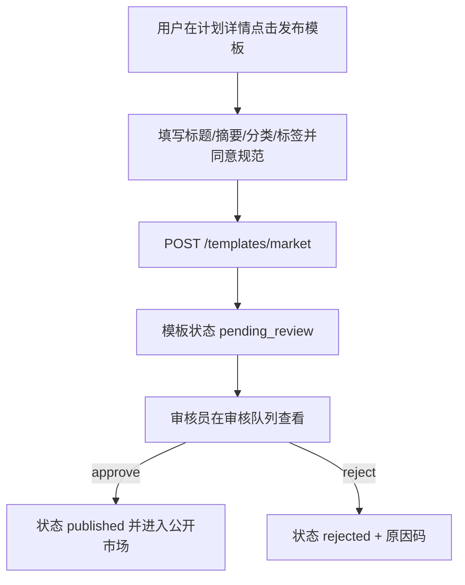
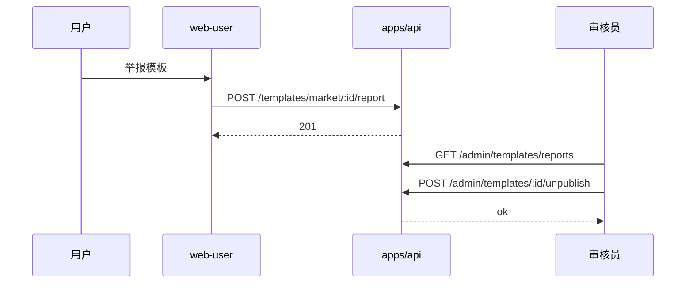

# PRD：web-user「模板市场（公开 UGC）」商用落地（审核/治理/版本/运营）

| 属性 | 内容 |
|------|------|
| 状态 | **草稿**（2026-05-09） |
| 产品 | 计划大师（ai-plan / web-user + api） |
| 记忆目录 | `ai-plan/.ai/` |
| 关联能力 | 计划域（Plan）、用户体系（Auth）、Telemetry/Analytics（埋点/审计） |

---

## 1. 项目目标

把现有「模板市场」从“功能可用”升级到“**可公开商用**”的 UGC 市场能力，重点闭合以下目标：

1. **可控发布**：模板发布默认进入审核或风控流程；可下架/驳回/封禁；公开展示稳定可控。
2. **可追溯**：模板发布/审核/下架/编辑/套用等关键操作全量审计；可定位到用户与版本快照。
3. **可运营**：分类/标签/推荐位/精选/官方模板等可配置；具备冷启动与质量控制策略。
4. **可扩展**：模板版本化；更新策略不破坏已套用历史；API 兼容演进。

---

## 2. 要解决的问题与方案概述

| 问题 | 方案 |
|------|------|
| UGC 发布即上线，存在违规/低质/滥用风险 | 引入模板状态机 + 审核队列 + 举报处置 + 基础风控/频控 |
| 关键行为缺乏可追溯与合规闭环 | 审计日志（作者/管理员）+ 事件埋点口径统一 |
| 用户套用前信息不足，转化与体验受限 | 模板详情页 + 结构化预览（从 payload 生成可读摘要/结构） |
| 模板更新缺少版本策略，复现困难 | MarketTemplateVersion（快照）+ apply 绑定 versionId |

---

## 3. 角色与权限（用户端 + 管理端）

### 3.1 主要角色

- **普通用户（User）**：浏览市场；套用模板；发布模板；管理自己模板；点赞/收藏；举报违规模板。
- **管理员/审核员（Admin/Reviewer）**：审核模板；下架/封禁；处理举报；查看审计与风险指标；配置推荐位（后续）。
- **运营（Ops）**：配置分类/标签/推荐位/精选；查看模板漏斗与质量指标（后续，可依赖 Analytics）。

### 3.2 权限点（P0 最小集合）

> 用户端以 `requireRole('user')` 为主；管理端以 permission 为主（沿用已有 RBAC/审计能力）。

- 用户端：
  - `templates:publish`（默认所有 user 拥有；若引入分级/白名单可收紧）
  - `templates:manage_own`（编辑/下架自己模板）
  - `templates:report`（举报）
- 管理端：
  - `templates:review`（审核通过/驳回）
  - `templates:moderate`（下架/封禁/解除）
  - `audit:read`（审计查看）
  - `analytics:read`（查看模板市场指标看板，后续）

---

## 4. 范围（本期 / 里程碑拆分）

### 4.1 In Scope（P0：商用必需闭环）

#### A. 模板状态机与生命周期（作者侧）

- 发布默认进入 `pending_review`（或风控直发/白名单直发，作为可选开关）
- 作者可：
  - 查看自己模板列表（含状态：待审/已发布/驳回/已下架/封禁）
  - 编辑元信息（title/summary/category/tags）→ 触发重新审核
  - 下架（unpublish）→ 市场不可见，但保留审计与版本快照

#### B. 审核队列与审计（管理侧）

- 审核队列：按时间/状态分页查询
- 审核动作：approve/reject，需填写原因码（枚举）+ 备注（可选）
- 全量审计：发布/编辑/审核/下架/封禁/套用/举报

#### C. 举报与处置

- 用户可举报模板（原因、描述、证据）
- 管理端可查看举报并对模板/作者处置（下架、限制发布、封禁）

#### D. 基础反滥用（v1）

- 发布/点赞/收藏/套用/举报基础限流（按 userId + IP）
- 刷赞/刷套用的最小防护：重复操作幂等；异常阈值告警（后续增强）

### 4.2 Out of Scope（后续里程碑）

- 高级搜索（分词/同义词/召回排序模型）
- 运营配置台（推荐位、精选、置顶、黑白名单）
- 组织内模板市场/多租户隔离（未来混合市场）
- A/B 实验、增长触达闭环

---

## 5. 功能需求与业务规则

### 5.1 模板状态机（建议）

> 现有实现：发布即 `status: published`；本 PRD 目标：引入可控生命周期。

状态建议（可根据现有 Prisma enum/字段实现调整）：

- `draft`：仅作者可见（可选；若不做则省略）
- `pending_review`：待审核
- `published`：公开可见
- `rejected`：驳回（作者可见原因；可再次编辑提交）
- `unpublished`：作者下架或管理员下架
- `banned`：封禁（模板或作者层级；对外隐藏）

### 5.2 发布规则（v1）

- 发布请求必须提供 `planId` 或 `payload` 二选一（沿用 `packages/shared/src/template-schemas.ts` 约束）
- 如果从 `planId` 导出：必须属于本人（已存在校验）
- 发布频控：每用户每小时上限 N（默认 10，可配置）
- 发布前必须同意《模板发布规范》（前端勾选，后端可记录 acceptedAt）

### 5.3 编辑/更新规则（v1）

- 允许编辑的字段：`title/summary/category/tags`
- 编辑触发重新审核：状态回到 `pending_review`，市场侧隐藏或继续展示旧版本（取决于版本策略，见 5.5）

### 5.4 套用规则（v1）

- apply 成功后生成新计划（已存在 `createGeneratedPlan` 流程）
- apply 记录必须绑定模板版本快照（P1/P0 视实现成本）
- apply 计数 `applicationCount` 增加（已存在）

### 5.5 版本策略（建议）

- MarketTemplate 为“主记录”，新增 MarketTemplateVersion 保存每次发布/更新的 payload 快照
- 公开展示使用 `currentPublishedVersionId`
- apply 绑定 versionId，保证复现与审计一致

---

## 6. 非功能需求

| 类型 | 要求 |
|------|------|
| 合规 | 举报入口与处理流程可追溯；敏感信息不进入模板 payload；审计日志长期保留 |
| 安全 | 操作鉴权与最小权限；频控/幂等；管理员操作全审计 |
| 体验 | 发布/审核状态透明；驳回可解释；列表/详情在弱网下可恢复 |
| 可观测 | 模板域关键事件埋点口径统一；核心指标可做漏斗（发布→审核通过→曝光→套用） |

---

## 7. 技术决策与约束（初稿）

- 前端：`apps/web-user` 现有 `TemplatesPage.vue` 继续演进；新增模板详情页（后续里程碑）与“我的模板管理”区。
- 后端：`apps/api` 模板域扩展状态机、审核/举报/审计/频控；尽量复用已有 RBAC + audit 基础设施。
- 数据：保持 Postgres/Prisma；版本快照 payload 用 jsonb 存储，并做最小字段白名单校验（已存在 `parseTemplatePayload`）。

---

## 8. 任务序列（实施顺序建议）

1. 现状梳理与口径固化（接口/埋点/状态，补齐 PRD/架构文档）。
2. 状态机与作者侧生命周期（pending_review/unpublish/edit）。
3. 审核队列与审计闭环（admin API + 审核记录）。
4. 举报与处置（report + moderate）。
5. 版本化与详情/预览（TemplateDetail + version binding）。

---

## 9. 验收标准（可测试）

1. 用户发布模板后，模板不会直接出现在公开市场（默认 pending_review），作者在“我的模板”可看到状态与提交时间。
2. 审核员可以在审核队列中看到待审模板，并能通过/驳回；驳回原因对作者可见。
3. 已发布模板可在公开市场列表中展示；匿名用户可浏览，登录用户可看到点赞/收藏状态。
4. 用户可举报模板；管理员可查看举报并执行下架/封禁；下架后模板从市场不可见且不可套用。
5. 发布/审核/下架/套用等关键动作都能在审计日志中查到（含操作人、对象、时间、原因/备注）。

---

## 10. 关键用例流程图（Mermaid）

### 10.1 用户发布模板 → 审核 → 上线

### 10.2 举报与处置

---

## 11. 待决策事项（评审时填写）

- [ ] 审核策略：默认全量审核还是风控命中再审核？是否存在“官方/白名单直发”？\n
- [ ] 编辑上线策略：编辑后隐藏旧版本还是保持旧版本继续展示？\n
- [ ] 频控参数：发布/点赞/收藏/套用/举报的阈值默认值。\n
- [ ] 模板详情是否对外公开 payload 的裁剪字段范围（避免泄露敏感信息）。\n

---

## 12. 审批

- 审批人：用户  \n
- 结论：**待审批**  \n
- 日期：2026-05-09  \n

