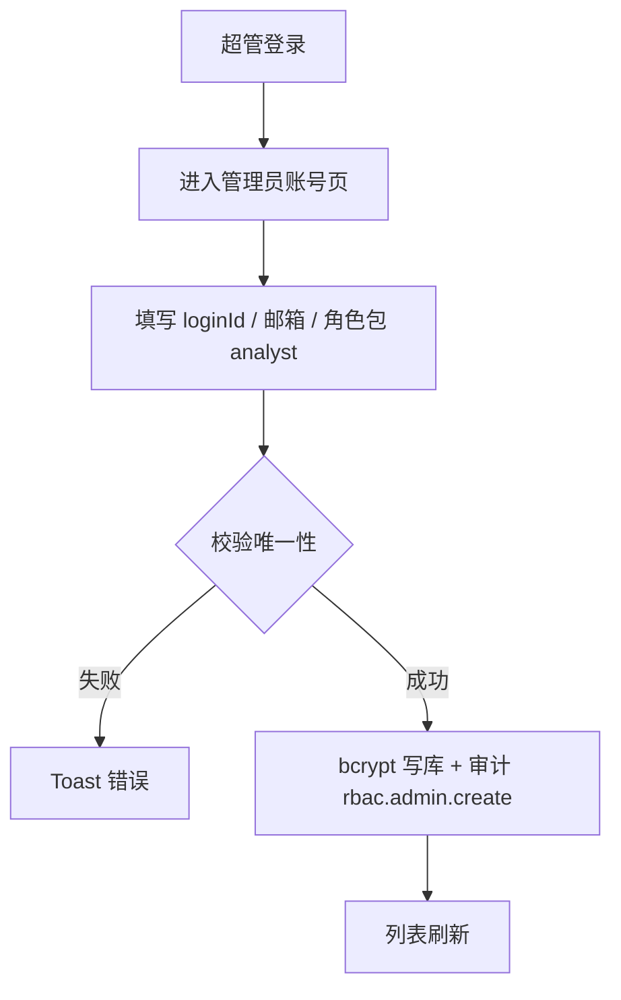
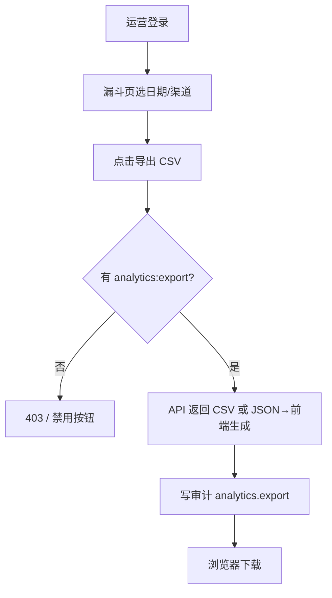

# PRD：web-admin 角色治理与运营闭环（Role Governance v1）

| 属性 | 内容 |
|------|------|
| 状态 | **已批准**（2026-06-01） |
| 产品 | 计划大师（ai-plan / web-admin） |
| 记忆目录 | `ai-plan/.ai/` |
| 关联 Epic | `.ai/epics/epic-web-admin-role-governance.md` |
| 前置能力 | 运营增长分析工作台（`.ai/specs/2026-04-22-web-admin-growth-analytics-prd.md`）、Story 012 RBAC 基础 |

---

## 1. 项目目标

将管理端从「权限点 + 只读报表展示」升级为 **角色驱动的治理与运营控制台**，使三类岗位（超级管理员 / 运营分析 / 审计只读）在登录后即有清晰的首页、菜单与可操作闭环，并兑现已定义但未落地的权限能力（`analytics:export`、`rbac:manage`）。

**成功标准（Epic 级）：**

1. 登录后按角色进入不同默认首页，导航与总览模块与岗位匹配。
2. 超级管理员可在 UI 内管理 `AdminUser`（创建、改权限包、禁用、重置密码），且全部写操作留审计。
3. 运营分析可在漏斗/留存/路径页导出 CSV，导出行为写入审计日志。
4. 审计员默认进入审计工作台，不强制依赖「分析总览」作为首页。
5. 注册策略可配置：生产默认关闭自助注册，仅超管创建账号。

---

## 2. 要解决的问题

| 问题 | 现状 | 目标方案 |
|------|------|----------|
| 角色只是标签反推 | `getAdminRoleLabel` 启发式推断 | 引入 **角色包配置**（preset key + permissions），UI 展示与路由策略统一读取 |
| `rbac:manage` 无治理 UI | 仅有权限说明页 | 管理员账号 CRUD + 权限包分配 |
| `analytics:export` 未兑现 | 权限存在，无导出 | 分析页 CSV 导出 + `requirePermission('analytics:export')` + 审计 |
| 审计员体验混乱 | 含 `analytics:read` 时进总览 | 审计员 preset 调整为 **无 analytics:read**（或可选只读分析），默认 `/admin/audit-logs` |
| 规则/提交只读无闭环 | 无法运维阈值 | P1：规则编辑 + 审计；P1：提交筛选增强 |
| Telemetry 重算无入口 | API 已有，前端无 | 超管/运营可见「按日重算」运维面板 |

---

## 3. 角色与权限矩阵（目标态 v1）

### 3.1 预置角色包

| 角色包 key | 中文名 | 默认首页 | 权限点 |
|------------|--------|----------|--------|
| `super-admin` | 超级管理员 | `/admin/dashboard`（值班台） | 全量 |
| `analyst` | 运营分析 | `/admin/dashboard`（增长摘要） | `analytics:read`, `analytics:export`, `users:read` |
| `auditor` | 审计只读 | `/admin/audit-logs` | `audit:read`, `analytics:export`（仅审计相关导出，见 3.3） |

> **变更说明**：`auditor` 不再默认包含 `analytics:read`，避免与「合规只读」定位冲突。若需只读查看漏斗，由超管在自定义权限中追加。

### 3.2 页面 × 权限矩阵

| 页面/能力 | 超级管理员 | 运营分析 | 审计只读 |
|-----------|:----------:|:--------:|:--------:|
| 总览（超管值班台） | ✓ | — | — |
| 总览（增长摘要） | ✓ | ✓ | — |
| 漏斗 / 留存 / 路径 | ✓ | ✓ | — |
| 分析 CSV 导出 | ✓ | ✓ | — |
| 用户列表/详情 | ✓ | ✓ | — |
| 规则（读） | ✓ | ✓ | — |
| 规则（写） | ✓ | P2 可选 | — |
| 提交流水 | ✓ | ✓ | — |
| 审计日志 | ✓ | — | ✓ |
| 审计 CSV 导出 | ✓ | — | ✓ |
| 管理员账号管理 | ✓ | — | — |
| Telemetry 日聚合重算 | ✓ | ✓ | — |
| 权限说明页 | ✓ | ✓ | ✓ |

### 3.3 权限点语义（不变，补充落地规则）

- `analytics:read`：分析报表、总览、规则只读、提交流水只读。
- `analytics:export`：漏斗/留存/路径 CSV 导出（写 `audit_log`，action=`analytics.export`）。
- `users:read`：业务用户 drill-down。
- `audit:read`：审计列表；含 `analytics:export` 时可导出审计 CSV（action=`audit.export`）。
- `rbac:manage`：管理员账号 CRUD、改权限、禁用、重置密码。

---

## 4. 关键用例流程

### 4.1 超级管理员创建运营账号



### 4.2 运营导出漏斗报表



### 4.3 审计员登录

```mermaid
flowchart TD
  A[审计员登录] --> B[getDefaultAdminPath]
  B --> C[/admin/audit-logs]
  C --> D[高风险筛选 + 时间范围]
  D --> E{导出?}
  E -->|是| F[audit.export 审计]
```

### 4.4 错误处理

- 无权限访问路由 → `/admin/forbidden?required=...`
- 写操作失败 → 4xx/5xx + Toast；审计写入失败不阻塞主流程但打 error log
- 禁用账号登录 → 401 + 明确文案「账号已禁用」

---

## 5. 范围

### 5.1 In Scope（P0）

1. **角色产品化**：`admin-access.ts` 扩展 role preset、默认首页、导航过滤、总览模块开关。
2. **管理员账号 API + UI**：列表、创建、改权限包、禁用/启用、重置密码（`rbac:manage`）。
3. **分析 CSV 导出**：漏斗/留存/路径 + 审计记录。
4. **审计员首页**：独立审计工作台（可复用现有 AuditLogsPage 增强摘要区）。
5. **注册策略**：`ADMIN_OPEN_REGISTER` 默认 false；注册页显示「已关闭」态。
6. **种子与迁移**：更新 auditor preset 权限；现有 DB 中 auditor 账号 migration 脚本或 seed 说明。

### 5.2 In Scope（P1）

1. 规则配置编辑（`PATCH /admin/rules/:key`）+ 审计。
2. Telemetry 聚合重算 UI（调用已有 `POST /admin/telemetry/aggregate-day`）。
3. 提交列表：状态筛选、跳转用户详情增强。
4. 修改密码（当前管理员改自己的密码）。

### 5.3 Out of Scope（本期不做）

- 业务用户封禁/工单
- 细粒度字段级 RBAC
- SSO / OAuth
- 多租户

---

## 6. 技术决策与约束

| 决策 | 说明 |
|------|------|
| 角色存储 | v1 仍用 `AdminUser.permissions` JSON 数组；可选新增 `rolePreset` 字符串字段便于展示（非必须） |
| 密码 | bcrypt；重置密码由超管生成临时密码或发一次性 token（v1：超管设新密码） |
| 禁用 | `AdminUser` 新增 `disabledAt DateTime?`；登录时拒绝 |
| 审计 | 复用 `AuditLog` + 统一 `writeAuditLog()` 封装 |
| 导出 | 优先前端由已有 JSON 响应生成 CSV；大结果集 P1 改流式 API |
| 测试 | API 单测覆盖 403、审计写入；web-admin Vitest 覆盖路由默认首页与按钮 disabled |

---

## 7. 验收标准（可测试）

1. `auditor` preset 登录后 URL 为 `/admin/audit-logs`，侧栏无漏斗/留存/路径（除非自定义加了 `analytics:read`）。
2. 无 `rbac:manage` 访问 `GET/POST /admin/admin-users` 返回 403。
3. 超管创建 analyst 账号后，该账号可登录且仅有 analyst 菜单。
4. 有 `analytics:export` 时漏斗页导出成功，且 `audit_log` 存在对应记录。
5. `ADMIN_OPEN_REGISTER=false` 时 `POST /auth/register-admin` 返回 403，注册页展示关闭说明。
6. 禁用账号无法登录；启用后可登录。
7. 所有写操作（改权限、禁用、重置密码、规则改）均有审计行。

---

## 8. 任务序列（Story 映射）

见 `.ai/plans/2026-06-01-web-admin-role-governance-implementation-plan.md` 与 Epic 下 Feature/Story 列表。

| 阶段 | Story | 概要 |
|------|-------|------|
| P0-1 | Story 013 | 角色配置、默认路由、导航与总览分化 |
| P0-2 | Story 014 | 管理员账号 API（CRUD + 禁用 + 重置密码） |
| P0-3 | Story 015 | 管理员账号管理 UI |
| P0-4 | Story 016 | 分析 CSV 导出 + 审计 |
| P0-5 | Story 017 | 审计员工作台增强 + 审计导出 |
| P0-6 | Story 018 | 注册策略收口 + seed/migration |
| P1 | Story 019 | Telemetry 重算 UI |
| P1 | Story 020 | 规则编辑 + 审计 |

---

## 9. 风险与缓解

| 风险 | 缓解 |
|------|------|
| 现有 auditor 账号权限与新区不一致 | seed 文档 + 一次性 migration 更新 permissions |
| 导出数据量大 | v1 限制行数 + 提示；P1 异步任务 |
| 超管误删自己 | 禁止禁用/删除当前登录超管；至少保留一个 `rbac:manage` 账号 |

---

## 10. 审批记录

| 日期 | 操作 | 说明 |
|------|------|------|
| 2026-06-01 | 用户批准 | 「写入 ai-plan/.ai，已批准，开始写计划文档」 |
